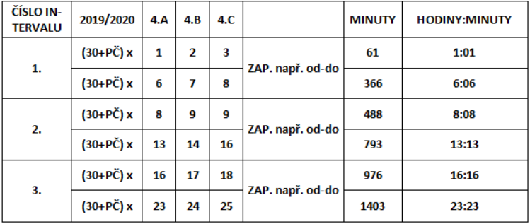

# Appliance Control Program

This repository contains the solution for controlling an appliance using a PLC (Programmable Logic Controller) Tecomat TC 600, implemented in the Mosaic programming environment. The program implements a sequence of operations based on the task description provided, ensuring control of the appliance within specified time intervals.

The project was developed by **Skelen** in collaboration with **Vašunka**.

## Task Description

The goal of this task is to create a program that controls an appliance based on time intervals during the week. The program includes the following functionality:

### Requirements

1. **Control the appliance from Tuesday to Saturday between 8:00 AM and 4:00 PM.**
2. **Sequentially turn on outputs from Y0.0 to Y0.7 in half a second and then turn them off from Y0.7 to Y0.0 in the second half of the cycle, with all outputs turned on in the middle of the cycle.**
3. **Sequentially turn on and off outputs from Y0.0 to Y0.7 in half a second, and in the second half of the second, turn on and off outputs from Y0.7 to Y0.0, but each output must be kept on individually.**
4. **Control the appliance based on specified intervals for each working day of the week as per the table below.**

### Task Outputs

The program is divided into four parts, each addressing one of the required functionalities:

- **Part 1**: Controls the appliance from Tuesday to Saturday, between 8:00 AM and 4:00 PM.
- **Part 2**: Sequentially turns on and off outputs from Y0.0 to Y0.7, followed by turning them off in reverse order.
- **Part 3**: Sequentially turns on and off outputs from Y0.0 to Y0.7, ensuring each output is individually turned on.
- **Part 4**: Controls the appliance according to the intervals for each working day of the week. (to do - not finished)

## Files

- **[Part 1 - Appliance Control (Time-based)](part1.asm)**: Controls the appliance within the specified time window.
- **[Part 2 - Sequential Output Control](part2.asm)**: Turns on outputs sequentially from Y0.0 to Y0.7 and off in reverse order.
- **[Part 3 - Individual Output Control](part3.asm)**: Ensures each output is individually controlled.
- **[Part 4 - Weekly Appliance Control](part4.asm)**: Controls the appliance based on the time intervals for each working day of the week. (to do - not finished)

## Image

The following image shows the time intervals for the appliance control for each day of the week as described in the task:

## Setup

Ensure that you have the necessary tools and hardware to run this program:

- **PLC Tecomat TC 600**
- **Mosaic Programming Environment**
- **Appliance model for demonstration**

For setup instructions, please refer to the [Tecomat documentation](https://www.tecomat.cz/ke-stazeni/software/mosaic/).

## Conclusion

This project demonstrates the control of an appliance based on different conditions, including time intervals for each day of the week. The task was completed using PLC programming standards in the Mosaic environment for the Tecomat TC 600 system. The program was developed collaboratively with **Vašunka**.
