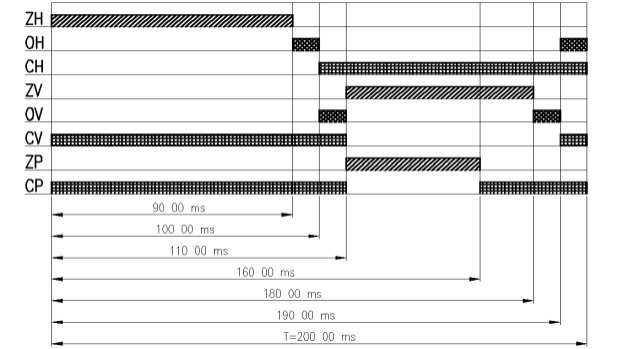

# Traffic Light Control Program

This repository contains the solution for controlling a traffic light intersection using a PLC (Programmable Logic Controller) Tecomat TC 600, implemented in the Mosaic programming environment.

## Task Description

The goal of this task is to create a traffic light control program for a traffic intersection using the PLC Tecomat TC 600. The program was developed in three variations, each using a different approach to control the traffic light outputs. The program executes a timing sequence as follows:

- Cycle time (T) = 32 seconds
- Orange light duration: 1/20 of T = 2 seconds
- Green pedestrian light duration: 1/4 of T = 8 seconds
- The red light on the main road is activated at the midpoint of the cycle.

### Control Methods

1. **Using the RES and SET instructions to control all outputs simultaneously.**
2. **Using the RES and SET instructions to control each output individually.**
3. **Using GT, LT, and WR instructions for controlling outputs.**

## Task Outputs

The program includes three versions based on the control method:

- **Part 1**: All outputs controlled simultaneously using the RES and SET instructions.
- **Part 2**: Each output controlled individually using RES and SET instructions.
- **Part 3**: Outputs controlled using GT, LT, and WR instructions.

## Files

- **[Part 1 - All Outputs Simultaneously](part1.asm)**: This version of the program sets and resets all outputs at once.
- **[Part 2 - Individual Outputs Control](part2.asm)**: This version controls each output separately using RES and SET instructions.
- **[Part 3 - Using GT, LT, WR Instructions](part3.asm)**: This version uses the GT, LT, and WR instructions for controlling the outputs.

## Image
- Example image

## Setup

Ensure that you have the necessary tools and hardware to run this program:

- **PLC Tecomat TC 600**
- **Mosaic Programming Environment**
- **Traffic light model for demonstration**

For setup instructions, please refer to the [Tecomat documentation](https://www.tecomat.cz/ke-stazeni/software/mosaic/).

## Conclusion

This project demonstrates a basic traffic light control program with different approaches to controlling the PLC outputs. The task was completed using PLC programming standards in the Mosaic environment for the Tecomat TC 600 system.

